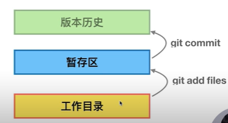

# 1. Git 介绍

[官方地址](https://git-scm.com/)

[文档地址](https://git-scm.com/book/zh/v2)


## 1.1 Git安装

[安装文档说明](https://git-scm.com/book/zh/v2/%E8%B5%B7%E6%AD%A5-%E5%AE%89%E8%A3%85-Git)


## 1.2 配置

### 1.2.1 添加配置

```shell
git config [--local | --global | --system] user.name 'Your name'
git config [--local | --global | --system] user.email 'Your email'
```

示例:

```shell
添加最小配置:
git config --local user.name 'lunzi'
git config --local user.email 'lunzi@163.com'
```


### 1.2.2 查看配置

```shell
git config --list [--local | --global | --system]
```

示例:

```shell
git config --list --local ##只能在仓库里面起作用, 普通路径git不管理
git config --list --global
git config --list --system
```


参数区别:

- git config --local ##只对某个仓库有效,切换到另外一个仓库失效
- git config --global ##当前用户的所有仓库有效,工作当中最常用
- git config --system ##系统的所有用户,几乎不用


### 1.2.3 清除设置

```shell
git config --unset --local user.name
git config --unset --global user.name
git config --unset --system user.name
```


## 1.3 创建Git仓库

### 1.3.1 把已有的代码纳入Git管理

```shell
cd 项目代码所在的文件夹
git init
```


### 1.3.2 新建的项目直接用Git管理

```shell
cd 某个文件夹
git init your_project #会在当前路径下创建和项目名称同名的文件夹
cd your_project
```


### 1.3.3使用场景

本地有个项目代码写了一段时间了，但还没有用 git 管理起来，现在想用git在本地帮着记录变更的版本

```shell
cd existing_folder （本地进入到项目文件夹内）
git init （执行 init 命令，会创建出 .git 目录）
git add . （把项目文件加入到 git 的暂存区）
git commit -m "Initial commit" （创建第一个 git 的commit ）
```


很早之前本地生成了一个 git 的仓库，开发了一段时间，想把这个git仓库提交到公司git服务器新建的project中

```shell
cd existing_repo
git remote add origin git@your_git_server:your_group/your_project.git
git push -u origin --all
git push -u origin --tags
```


## 1.4 认识工作区和暂存区

 


暂存区的作用:

一个问题在解决掉之前，我可能需要反复修改几个相同的文件，等一种方式测试后，我先把涉及的变更存到暂存区，然后在工作目录又开始改代码，试试其他方法会不会更好。最后再确定最后的变更，然后形成commit。
正式提交后固然也能回退，但毕竟没有暂存区便捷。

```shell
git add #添加到暂存区
git status #显示工作目录和暂存区的状态
git commit -m'Add style.css' #提交日志
git log #查看日志
```


## 1.5 给文件重命名

```shell
#从暂存区删除
git rm file_name
#清除暂存
git reset --hard
#重命名
git mv oldFiles newFiles
```


## 1.6 git log 详解

```shell
# 查看当前分支的历史
git log
# 查看单行的简洁历史
git log --oneline
#查看最近的四条简洁历史
git log --oneline -n4
# 查看当前分支
git branch -v
# 创建分支
git checkout -b temp 415c5c8086e
# 查看所有分支
git branch -av
# 查看所有分支的历史
git log --all
# 查看所有分支的历史 图形化
git log --all --graph

```


## 1.7 图形化界面


```shell
gitk
```

工具:

- gitKraken
- Sourcetree


## 1.8 探秘.git目录

//cat命令主要用来查看文件内容，创建文件，文件合并，追加文件内容等功能。
cat HEAD 查看HEAD文件的内容
git cat-file 命令 显示版本库对象的内容、类型及大小信息。
git cat-file -t b44dd71d62a5a8ed3 显示版本库对象的类型
git cat-file -s b44dd71d62a5a8ed3 显示版本库对象的大小
git cat-file -p b44dd71d62a5a8ed3 显示版本库对象的内容

HEAD：指向当前的工作路径
config：存放本地仓库（local）相关的配置信息。
refs/heads:存放分支
refs/tags:存放tag，又叫里程牌 （当这次commit是具有里程碑意义的 比如项目1.0的时候 就可以打tag）
objects：存放对象 .git/objects/ 文件夹中的子文件夹都是以哈希值的前两位字符命名 每个object由40位字符组成，前两位字符用来当文件夹，后38位做文件。


```shell
# 删除分支
git branch -D 分支名字
```


```shell
#用 -u 有个好处，避免把工作区没准备好的新文件直接加到暂存区了
git add -u：将文件的修改、文件的删除，添加到暂存区。
git add .：将文件的修改，文件的新建，添加到暂存区。
git add -A：将文件的修改，文件的删除，文件的新建，添加到暂存区。
# git 1.x版本中 git add . 和 git add -A 确实存在能否追踪到已删除文件的区别；但在 git 2.x 版本中，已经没有此区别了。
# add . 是对当前路径及其子路径下的变更有效。而 add -A 是整个仓库。
git add .：将工作空间新增和被修改的文件添加的暂存区
git add -u:将工作空间被修改和被删除的文件添加到暂存区(不包含没有纳入Git管理的新增文件)

git add . 将已修改的文件（包括未跟踪的文件和已跟踪的文件）添加到暂存区
git add -u将已修改的文件（只包含已跟踪的文件）添加到暂存区
```


```shell
# 清屏
Mac: clear
Windows: cls

# 展示文件夹内的内容
Mac: ls -al
Windows: dir

# 展示文件内容（比如展示style.css的内容）
Mac: vi style.css
Windows: more style.css
```

 


# 2. Windows中使用类似Linux命令

https://git-scm.com/download/win 到git官网下载windows安装程序，安装完后打开 git bash 就能执行和视频一样的命令了。


```shell
 #显示当前路径下所有文件（包含隐藏文件）
 ls -al
 #递归
 cp -r 
```

