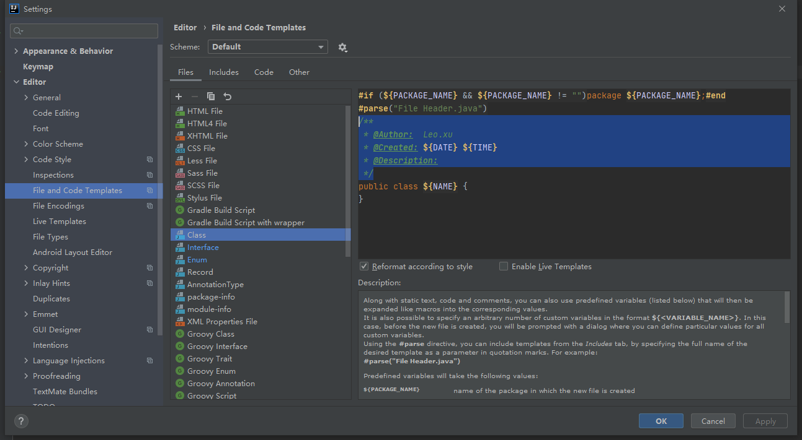
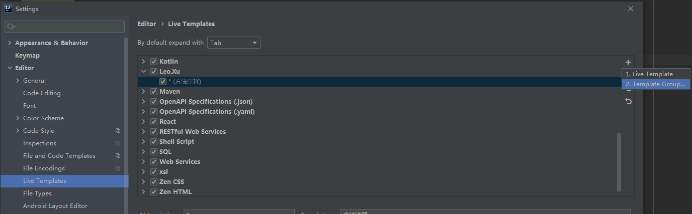
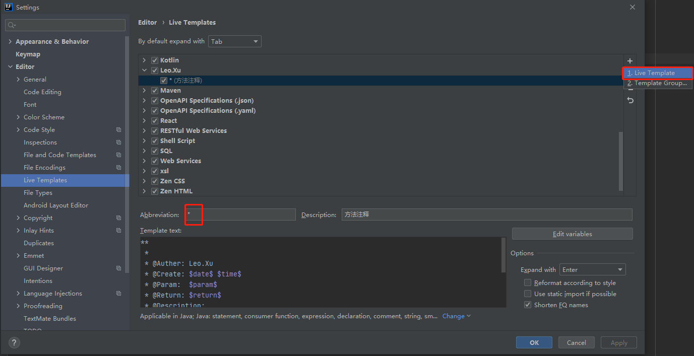
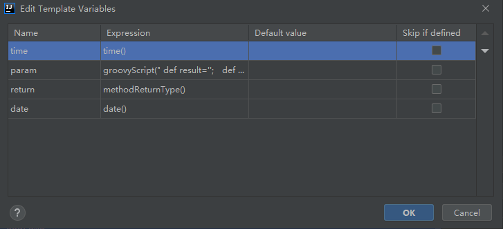
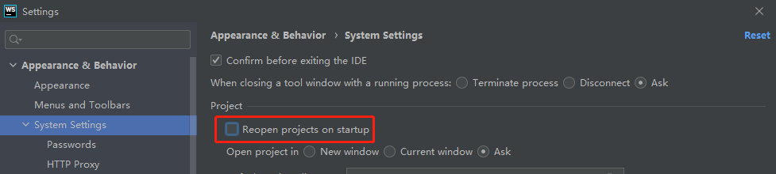

# 1. 注释模板

## 1.1 类 注释

  


```
/**
 * @Author:  Leo.xu
 * @Created: ${DATE} ${TIME}
 * @Description:
 */
```


## 1.2 方法注释

 


 


```
**
 *
 * @Auther: Leo.Xu
 * @Create: $date$ $time$
 * @Param:  $param$
 * @Return: $return$
 * @Description:
 */
```


 


```
 groovyScript("  def result='';    def params=\"${_1}\".replaceAll('[\\\\[|\\\\]|\\\\s]', '').split(',').toList();     for(i = 0; i < params.size(); i++) {       if(i!=0)result+= ' * ';        result+=params[i] + ((i < (params.size() - 1)) ? '\\n' + '\\t' : '');     };      return result", methodParameters()) 
```


# 2. 关闭idea启动自动开启最近项目

 