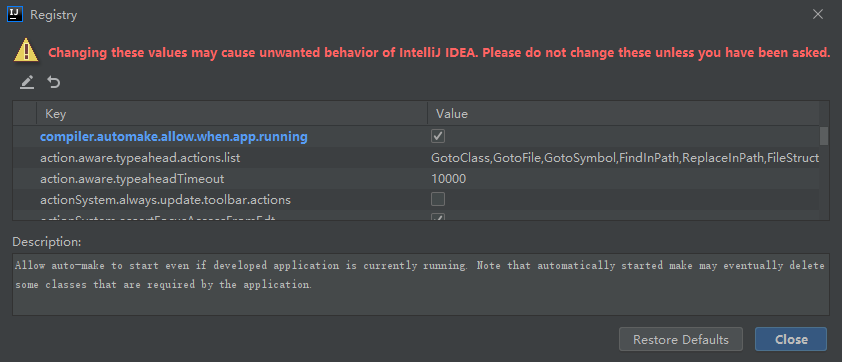
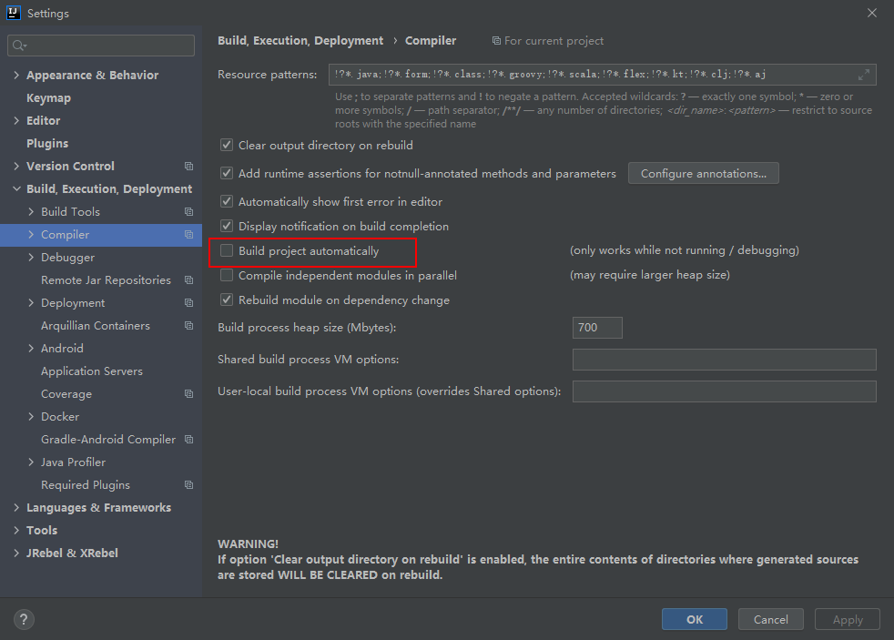
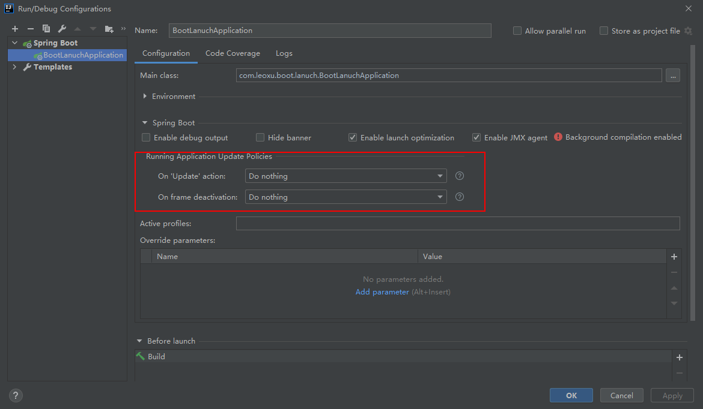
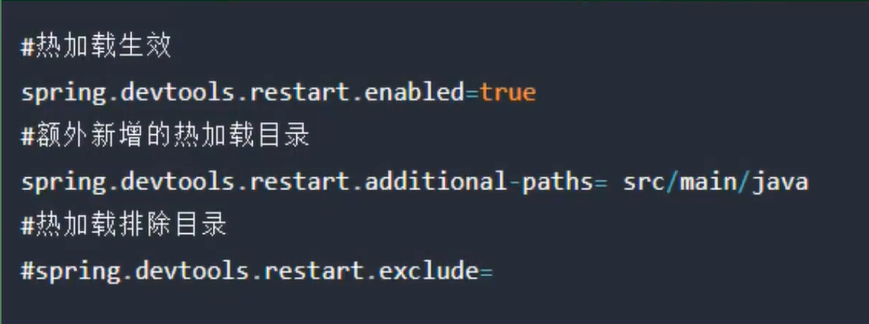
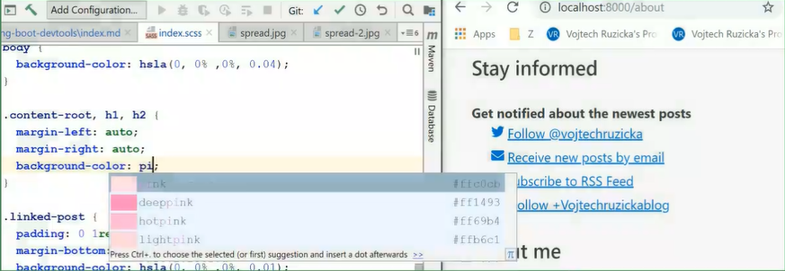
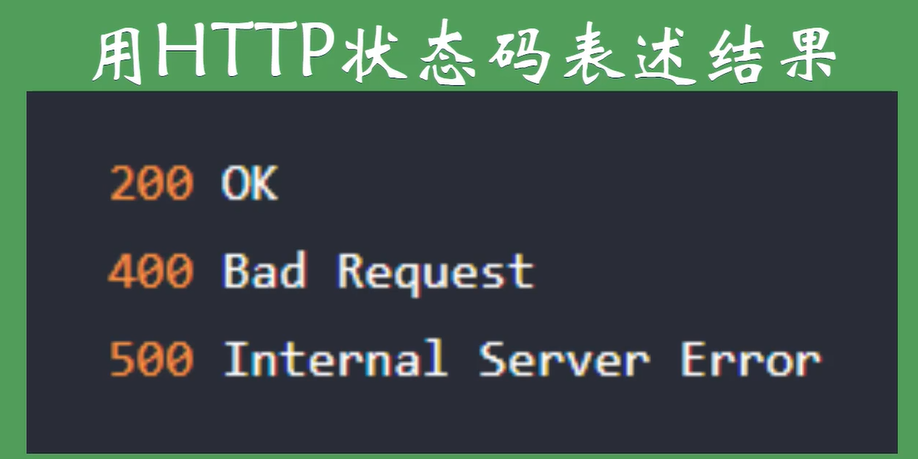
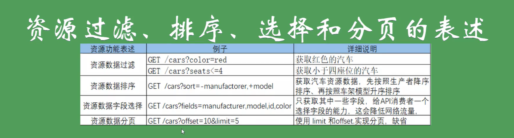
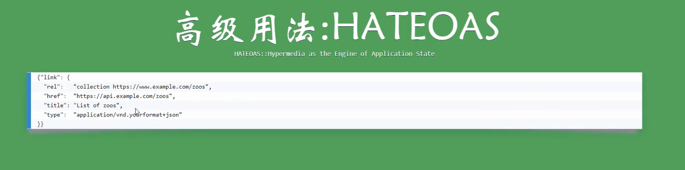

# 提高开发效率插件 Lombok

1. intellij idea 中安装 lombok 插件

2. 引入pom坐标 , 在springboot中无需添加版本号

   ```xml
   <dependency>
       <groupId>org.projectlombok</groupId>
       <artifactId>lombok</artifactId>
       <optional>true</optional>
   </dependency>
   ```

   

> @Data

```java
@Data
public class User {

    private String name;
    private Integer age;
}
```

编译后的class文件会自动加上

1. get/set方法
2. equals方法
3. toString方法
4. canEqual方法
5. hashCode方法
6. 默认无参数构造方法

> @Slf4j

```java
@Data
@Slf4j
public class User {

    private String name;
    private Integer age;
}
```

编译后的class文件中多了

```java
private static final Logger log = LoggerFactory.getLogger(User.class);
```


> @Builder

```java
@Data
@Slf4j
@Builder
public class User {

    private String name;
    private Integer age;
}
```

在其他地方想创建该类的对象就不需要使用`new`关键字了

```java
User.builder().name("zhangsan").age(22).build();
```


> @AllArgsConstructor

全参数构造函数

```java
@Data
@Slf4j
@Builder
@AllArgsConstructor
public class User {

    private String name;
    private Integer age;
}
```

使用全参数构造函数,默认的无参构造函数会没有,如果需要,要添加`@NoArgsConstructor`注解


# IDEA环境下的代码热部署

1. Jrebel插件

   File -> Settings -> Plugins -> Marketplace 搜索,下载

2. devtools

   pom文件中添加

   ```xml
   <dependency>
       <groupId>org.springframework.boot</groupId>
       <artifactId>spring-boot-devtools</artifactId>
       <optional>true</optional>
   </dependency>
   ```

ctrl + alt + shift + /   ->   registry







这里推荐不勾选,推荐 ctrl+F9 或者

 


旧版本idea 需要配置




旧版本devtools需要 在 application.yml 或者 application.properties 进行配置




# Live Reload插件

Google插件 不需要刷新浏览器




# 开发常用IDEA工具插件

- Codota
- Auto filling Java call arguments
- GsonFormat
- Rainbow Brackets
- Maven Helper


# RESTful风格API 与 HTTP协议


 


 


 

 





